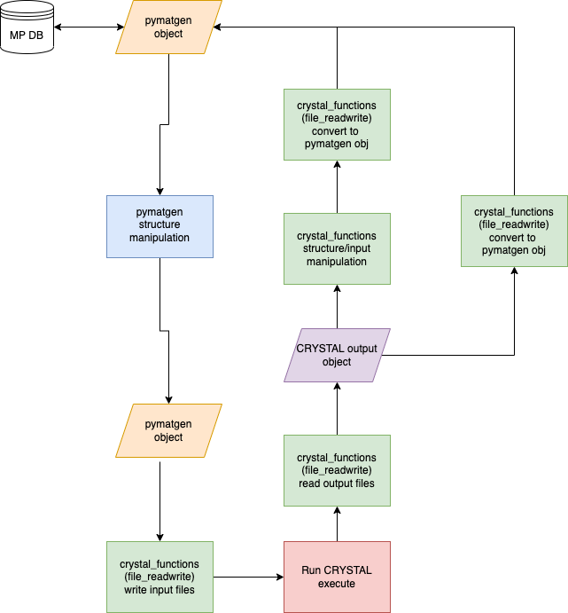

# crystal_functions
This repository contains functions that allow the user to access the
<a href="https://www.crystal.unito.it/index.php">CRYSTAL code</a>,
input, output and execution from a python infrastructure, such as
Jupyter Notebooks. Although they can achieve this goal on their own,
they achieve their full potential when used together with
<a href="https://pymatgen.org/index.html">pymatgen</a>. In this latter scenario, the crystal_functions could be seen as
a layer between CRYSTAL and pymatgen.

In January 2022 the first stable version (v2022.1.10) was released.

## Installation
The current release works for python<= 3.9.
crystal_functions will require <a href="https://pymatgen.org/index.html">pymatgen</a> to be installed
in the environment where you are running the functions.

If you intend to run CRYSTAL on the machine where you are running
the crystal_functions, the path to your local runcry amd runprop needs to be specified. To do so, please run the set_runcry_path and set_runprop_path functions:
```console
python 3
from crystal_functions.execute import set_runcry_path, set_runprop_path 
set_runcry_path('path_to_your_runcry')
set_runprop_path('path_to_your_runcry')
```

### pip
To install crystal_functions using pip, please use:
```console
pip install pymatgen
pip install crystal_functions
```

### conda
To install crystal_functions using conda, please use:
```console
conda install -c conda-forge pymatgen
conda install -c crystal-python-tools crystal_functions
```

Please note that both conda and pip will only install the functions and not the example notebooks. This decision was taken in order to reduce the volume of data transferred when installing. If you are interested in the example notebooks please read the section below.

## Examples
Each function is documented in Jupyter Notebooks that can be found in the  [example folder](example/). There is one notebook per function file (e.g. the functions contained in file_read_write.py are explained in the example/file_read_write.ipynb notebook).

## Usage
The following flowcharts cover a wide range of workflows where the
crystal_functions can be used. In order to run the CRYSTAL
calculation, input data needs to be written to file. Nonetheless,
crystal_function offers a much more approach flexible to do so.

Despite trying to be as comprehensive as possible, these
flowcharts will not cover all possible scenarios. Should you have
any question please feel free to contact the maintainers of
this repository.

### Start from a pymatgen object
This is the most flexible approach. Pymatgen gives the user the option to
<a href="https://pymatgen.org/pymatgen.ext.matproj.html?highlight=mprester#pymatgen.ext.matproj.MPRester">download structures</a>
from the Materials Project database.



### Start from CRYSTAL input file or manually prepare the input
In some instances, for example when studying a material for which
you already have an input file, it might be easier to create a Crystal_input object by reading the information from file. Some researchers might find it easier to manually prepare the input. This means that the input lines are specified as lists in python and then written to file using the wry_cry_input function.


### Output analysis only
This case applied to when the calculations were run on a different machine and the user might be interested in analysing the output. The inputs can be generated from any of the two workflows above by stopping before execution.


The functions are divided into files depending on their ultimate goal. For example, all the i/o functions are saved in crystal_functions/file_read_write.py. To access them, please use:

```console
from crystal_functions.file_read_write import Crystal_output

Crystal_output('output_name.out')
```

Each individual function contains either 'crystal' or 'cry' in its name. This was chosen, despite making the names of the functions longer, in order to avoid ambiguity. This means that when calling a function, you will know that it refers to a crystal_functions function and not, for example, a pymatgen one with a similar name.
