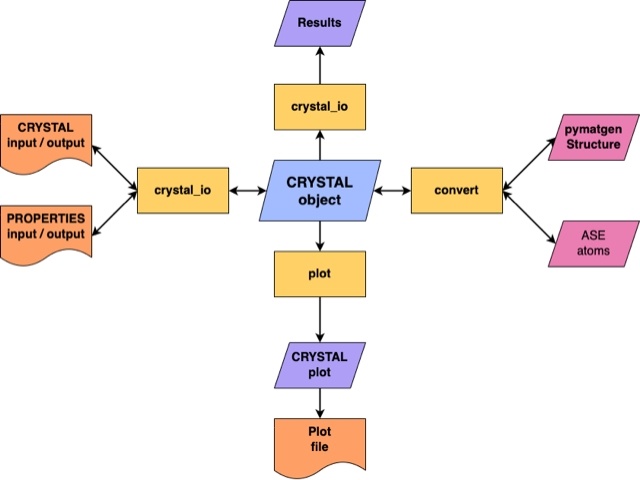

# CRYSTALpytools
This repository contains functions that allow the user to access the <a href="https://www.crystal.unito.it/index.php">CRYSTAL code</a>, input, output and execution from a python infrastructure, such as Jupyter Notebooks. Although they can achieve this goal on their own, they achieve their full potential when used together with <a href="https://pymatgen.org/index.html">pymatgen</a>. In this latter scenario, the CRYSTALpytools could be seen as
a layer between CRYSTAL and pymatgen.

In January 2022 the first stable version (v2022.1.10) was released.

## Installation

### Create a conda/anaconda environment
This step is not mandatory, but it makes using CRYSTALpytools very smooth. It is, therefore, very recommended. If you are new to anaconda, please follow <a href="https://docs.conda.io/projects/conda/en/latest/user-guide/install/index.html">these steps</a> to install it on your computer.

Create a new conda environment:
``` console
conda create --name crystal python=3.9
```

In the line above, “crystal” is the name of the environment and can be set to any you like. The “python=3.9” ensures that the suitable python distribution is installed.

Activate the conda environment:
``` console
conda activate crystal
```

### Install CRYSTALpytools

The CRYSTALpytools package can be installed from pip. Pip is a package-management system written in Python and is used to install and manage software packages (called modules in python).

``` console
pip install --upgrade CRYSTALpytools
```

Windows users might need to install windows-curses. This can be done by using:

``` console
pip install windows-curses
```

To check that CRYSTALpytools was install please type

``` console
conda list
```

This will return a list of all the modules installed in the environment. Here there should be crystalpytools. If this was not the case, something went wrong during the installation. Please check the location of the environment that is being displayed. This appears at the beginning of the “conda list” command. The most common mistake at this stage is that the environment was not activated as described above.


Please note that pip will only install the functions and not the example notebooks. This decision was taken in order to reduce the volume of data transferred when installing. If you are interested in the example notebooks please read the section below.

### Set the path to runcry and runprop

If you intend to run CRYSTAL on the machine where you are running the CRYSTALpytools, the path to your local runcry amd runprop needs to be specified. To do so, please run the set_runcry_path and set_runprop_path functions:
``` console
python 3
from CRYSTALpytools.execute import set_runcry_path, set_runprop_path
set_runcry_path('path_to_your_runcry')
set_runprop_path('path_to_your_runcry')
```

## Examples
Each function is documented in Jupyter Notebooks that can be found in the  [example folder](examples/). There is one notebook per function file (e.g. the functions contained in crystal_io.py are explained in the example/crystal_io.ipynb notebook).


## Tutorials
Tutorials can be found in the [tutorial folder](tutorial/)
## Usage

The CRYSTALpytools module aims at providing the user a python interface to the CRYSTAL code. The central data structure, called Crystal_object is created by the crystal_io by parsing CRYSTAL input/output files. The flowchart below is aimed at showing how different parts of the module interact with the Crystal_objects.



The following flowcharts cover a wide range of workflows where CRYSTALpytools can be used. In order to run the CRYSTAL calculation, input data needs to be written to file. Nonetheless, CRYSTALpytools offers a much more approach flexible to do so.

Despite trying to be as comprehensive as possible, these flowcharts will not cover all possible scenarios. Should you have any question please feel free to contact the maintainers of this repository.

### Start from a pymatgen object
This is the most flexible approach. Pymatgen gives the user the option to <a href="https://pymatgen.org/pymatgen.ext.matproj.html?highlight=mprester#pymatgen.ext.matproj.MPRester">download structures</a> from the Materials Project database.


### Start from CRYSTAL input file or manually prepare the input
In some instances, for example when studying a material for which you already have an input file, it might be easier to create a Crystal_input object by reading the information from file. Some researchers might find it easier to manually prepare the input. This means that the input lines are specified as lists in python and then written to file using the wry_cry_input function.


### Output analysis only
This case applied to when the calculations were run on a different machine and the user might be interested in analysing the output. The inputs can be generated from any of the two workflows above by stopping before execution.


The functions are divided into files depending on their ultimate goal. For example, all the i/o functions are saved in CRYSTALpytools/crystal_io.py. To access them, please use:

``` python
from CRYSTALpytools.crystal_io import Crystal_output

Crystal_output().read_cry_output('output_name.out')
```

Each individual function contains either 'crystal' or 'cry' in its name. This was chosen, despite making the names of the functions longer, in order to avoid ambiguity. This means that when calling a function, you will know that it refers to a CRYSTALpytools function and not, for example, a pymatgen one with a similar name.

## Testing
To test the CRYSTALpytools please run the test notebook that can be found in the [unit_test folder](unit_test/). Alternatively, please run the following command:

``` python
from CRYSTALpytools.unit_test import *

test_all('./data_test/')
```
where './data_test/' is the path to the test folder.

All values should return True if the test is passed.
